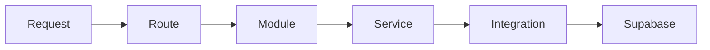

# Architecture

## Directory shape

| Layer        | Path                              | Role                                                                 |
| ------------ | --------------------------------- | -------------------------------------------------------------------- |
| Routes       | `src/app/api/**/route.ts`         | Thin: parse → validate (Zod) → auth → one module call → response    |
| Modules      | `src/app/lib/modules/<domain>/`   | Public API only; routes and other domains import from modules only   |
| Services     | `src/app/lib/services/<domain>/`  | Business logic; call integrations or other domains via modules       |
| Integrations | `src/app/lib/integrations/`       | Shared external clients (e.g. Supabase)                              |
| Legacy       | `src/lib/`                        | No new app imports from here                                         |

## Five rules

1. **Routes are thin:** Parse request, validate with Zod, check auth, call **one** module, return `NextResponse`.
2. **Modules are the only public API:** Routes and other domains import from `@/app/lib/modules/<domain>` only, not from services or integrations directly.
3. **Services hold business logic:** Modules re-export or call services. Services use integrations or other domains via **modules**.
4. **Integrations** are shared external clients (Supabase browser/server client).
5. **No new cross-boundary imports** into legacy/extractor code (`src/lib/`).

## Flow

## Domains and public API

- **auth:** `signIn(email, password)`, `signOut()`, `getSession()`
- **profiles:** `getProfile()`, `updateProfile(updates)`
- **logs:** `createOrUpdateDailyLog(dto)`, `getLogsByDateRange(from, to)`, `getLogByDate(date)`
