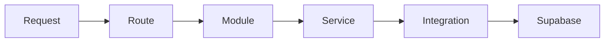

# Architecture

## Directory shape

| Layer        | Path                              | Role                                                                 |
| ------------ | --------------------------------- | -------------------------------------------------------------------- |
| Routes       | `src/app/api/**/route.ts`         | Thin: parse → validate (Zod) → auth → one module call → response    |
| Modules      | `src/app/lib/modules/<domain>/`   | Public API only; routes and other domains import from modules only   |
| Services     | `src/app/lib/services/<domain>/`  | Business logic; call integrations or other domains via modules       |
| Integrations | `src/app/lib/integrations/`       | Shared external clients (Supabase, Anthropic)                        |
| Legacy       | `src/lib/`                        | No new app imports from here                                         |

## Five rules

1. **Routes are thin:** Parse request, validate with Zod, check auth, call **one** module, return `NextResponse`.
2. **Modules are the only public API:** Routes and other domains import from `@/app/lib/modules/<domain>` only, not from services or integrations directly.
3. **Services hold business logic:** Modules re-export or call services. Services use integrations or other domains via **modules**.
4. **Integrations** are shared external clients (Supabase browser/server/admin clients, Anthropic).
5. **No new cross-boundary imports** into legacy/extractor code (`src/lib/`).

## Flow

```mermaid
flowchart LR
  Request --> Route
  Route --> Module
  Module --> Service
  Service --> Integration
  Integration --> Supabase
```

## Integrations

- **Supabase** (`src/app/lib/integrations/supabase/`) — browser client, server client, admin client (bypasses RLS)
- **Anthropic** (`src/app/lib/integrations/anthropic/`) — lazy-init Claude Haiku 4.5 client for macro photo extraction

## Domains and public API

- **auth:** `signIn(email, password)`, `signUp(email, password)`, `signOut()`, `getSession()`, `updatePassword(newPassword)`
- **profiles:** `getProfile()`, `updateProfile(updates)`
- **logs:** `createOrUpdateDailyLog(dto)`, `getLogsByDateRange(from, to)`, `getLogByDate(date)`
- **macros:** `extractMacrosFromImage(base64, mediaType)` — sends photo to Claude Haiku, returns `{ fat_g, carbs_g, protein_g }`
- **collectibles:** `getUserCollectibles()`, `getAllBadges()`
- **animations:** `getAllAnimations()`, `getAnimation(id)`, `getAnimationsForCreature(creatureId)`, `createAnimation(dto)`, `updateAnimation(id, dto)`, `deleteAnimation(id)`
- **reveal:** `rollReveal(userId)`, `logEncounter(userId, animationId, creatureId, firstEncounter)`, `getRevealOdds()`, `setRevealOdds(entries)`, `getUserEncounters(userId)`
